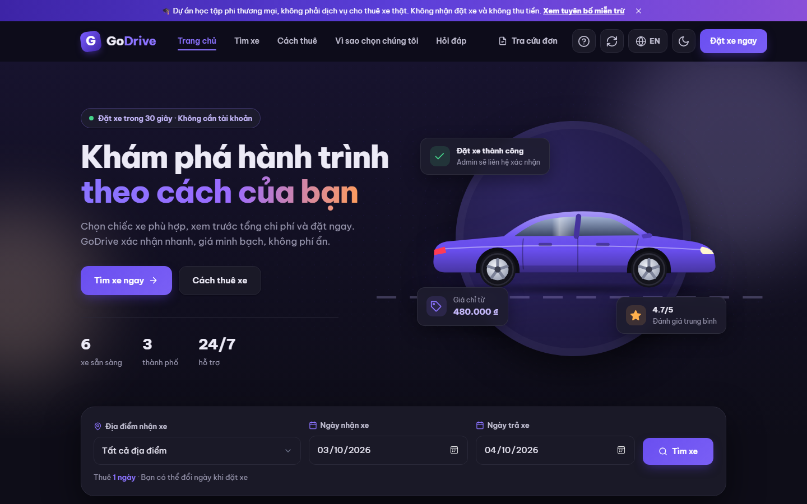
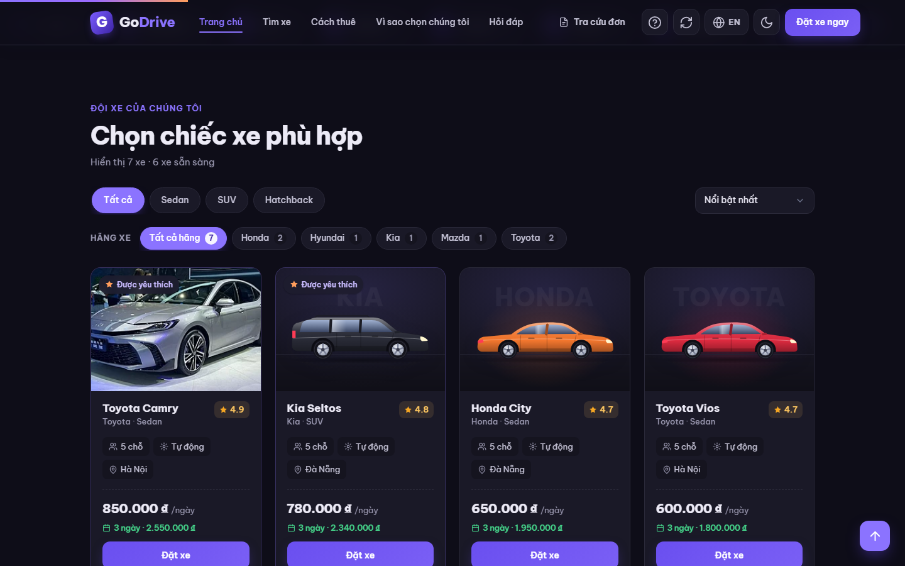
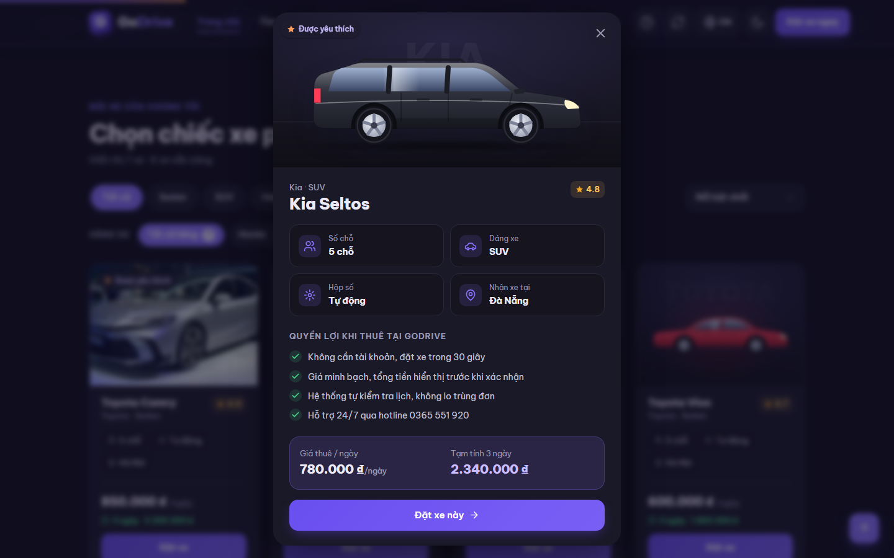
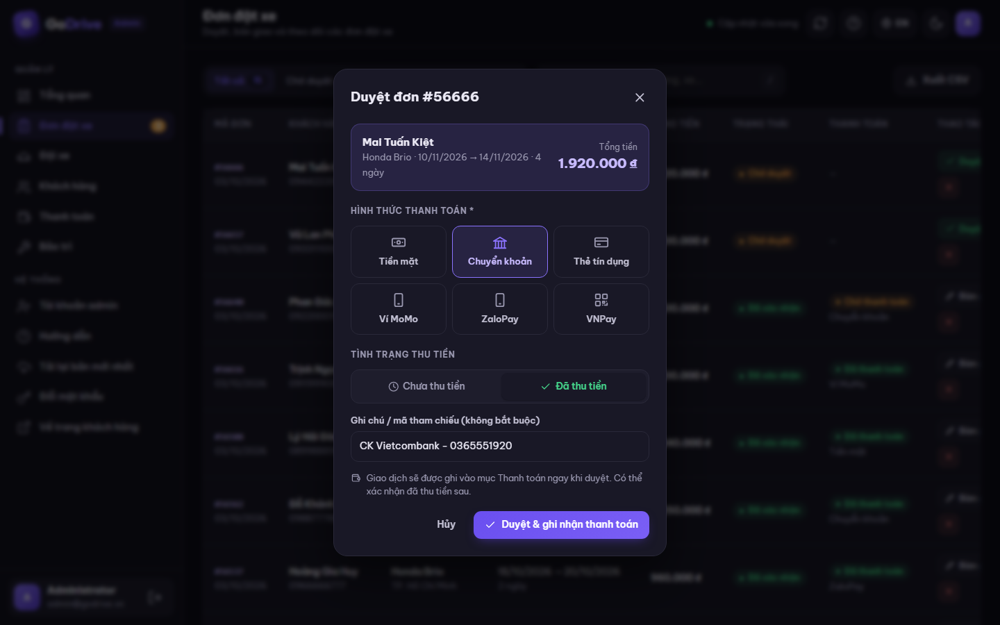
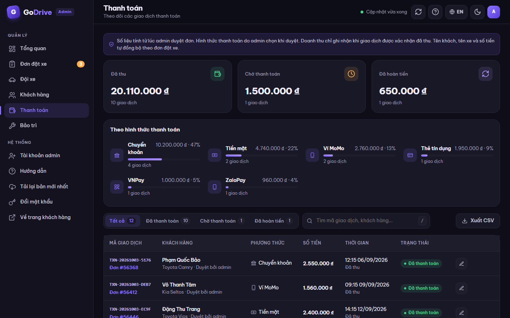

<div align="center">

# 🚗 GoDrive

### Self-drive car rental platform: customer site + admin dashboard

**Book in 30 seconds · No account needed · Transparent pricing**

[](https://www.php.net/)
[](#-tech-stack)
[-0f9f8f)](#data-files)
[](#-features)
[](#-features)
[](#%EF%B8%8F-disclaimer)

[**Live demo**](https://godrive.rf.gd) · [Admin](https://godrive.rf.gd/admin) · **English** · [Tiếng Việt](README.vi.md)

</div>

> [!IMPORTANT]
> **GoDrive is a non-commercial learning project, not a real car rental service.** No real bookings are fulfilled and no payments are accepted; all cars, prices and figures are sample data. Please use made-up details when trying the booking form. See the [Disclaimer](#%EF%B8%8F-disclaimer) and [`/disclaimer.html`](disclaimer.html).

---

## 📑 Table of contents

- [Overview](#-overview)
- [Screenshots](#-screenshots)
- [Features](#-features)
- [How it works](#-how-it-works)
- [Tech stack](#-tech-stack)
- [Getting started](#-getting-started)
- [Customer guide](#-customer-guide)
- [Admin guide](#%EF%B8%8F-admin-guide)
- [Deployment](#%EF%B8%8F-deployment)
- [Project structure](#%EF%B8%8F-project-structure)
- [API reference](#-api-reference)
- [Security](#-security)
- [Troubleshooting](#-troubleshooting)
- [Roadmap](#%EF%B8%8F-roadmap)
- [Disclaimer](#%EF%B8%8F-disclaimer)

---

## 🔎 Overview

GoDrive simulates the complete workflow of a small car rental business:

1. A customer browses the fleet, picks dates and books a car **without creating an account**.
2. An admin reviews the booking and **approves it, choosing the payment method** at the same time.
3. Once the payment is **confirmed as collected**, it counts toward revenue, and the customer's spending moves them up the **membership tiers**.

Everything runs on **plain HTML, CSS, JavaScript and PHP**, with data stored in JSON files, so it works on free PHP hosting (e.g. InfinityFree) with no database or build step.

---

## 📸 Screenshots

<table>
  <tr>
    <td width="62%"></td>
    <td width="38%">
      <h3>🏠 Home page</h3>
      <p>Animated hero with live figures (cars available, lowest price, average rating) and a search box for pick-up location and rental dates.</p>
    </td>
  </tr>
  <tr>
    <td width="38%">
      <h3>🚙 Fleet & filters</h3>
      <p>Filter by body type and brand, sort by price or popularity. Each card shows the estimated total for the selected dates. Cars without a photo get a generated illustration.</p>
    </td>
    <td width="62%"></td>
  </tr>
  <tr>
    <td width="62%"></td>
    <td width="38%">
      <h3>🔍 Car details</h3>
      <p>Specs, what's included, price estimate and similar cars, with one click to book.</p>
    </td>
  </tr>
  <tr>
    <td width="38%">
      <h3>📊 Admin dashboard</h3>
      <p>Collected revenue (paid transactions only) with 7/30-day charts and trends, amount awaiting payment, booking status, fleet status and a to-do list.</p>
    </td>
    <td width="62%"></td>
  </tr>
  <tr>
    <td width="62%"></td>
    <td width="38%">
      <h3>✅ Approve & record payment</h3>
      <p>Approving a booking requires choosing the payment method and whether the money was collected. The transaction is recorded immediately.</p>
    </td>
  </tr>
  <tr>
    <td width="38%">
      <h3>💳 Payments</h3>
      <p>Collected, awaiting and refunded totals, a breakdown by payment method, and a transaction history that stays in sync with bookings and can be edited.</p>
    </td>
    <td width="62%"></td>
  </tr>
</table>

<sub>All screenshots use dark mode and sample data.</sub>

---

## ✨ Features

### Customer site

| Area | What you get |
|---|---|
| **Browse** | Filter by body type (Sedan / SUV / Hatchback), brand and city; sort by price or popularity; brand marquee and city cards as shortcuts |
| **Car presentation** | Photos or generated SVG illustrations matching body type and paint colour; details popup with specs, inclusions and similar cars |
| **Booking** | No account; live total (daily rate × days); input rules (name: letters only, phone: 9–10 digits); double bookings blocked; max 90 days |
| **Tracking** | Look up bookings with just the email used to book; see booking and **payment status** plus **membership tier** and total rented |
| **Experience** | Vietnamese ↔ English, light ↔ dark (follows the OS on first visit), mobile-first layout, user guide popup, one-click "load latest version" |

### Admin dashboard (`/admin`)

| Area | What you get |
|---|---|
| **Dashboard** | Collected revenue, trend vs. the previous 30 days, amount awaiting payment, 7/30-day revenue chart, booking & fleet status, to-do list |
| **Bookings** | Tabs, search, details, call/email customer; **approve with payment method**, hand over car, cancel; payment column per booking |
| **Payments** | Created at approval; mark as paid; **edit** method, status, amount, collection time and note; method breakdown; auto-sync with bookings |
| **Fleet** | Add/edit/delete cars, photo URL or paint colour for the illustration, featured flag, status right on the card |
| **Customers** | Automatic ranking by spending with 5 tiers (Diamond = over 1 billion VND), tier filters, progress to the next tier |
| **Maintenance** | Schedule → start (car hidden from site) → complete (car available again) |
| **System** | Multiple admin accounts, change password with strength meter, CSV exports, auto-refresh every minute, `/` search shortcut, built-in guide |

---

## 🔄 How it works

### Booking lifecycle

```
                ┌──────────── Approve + choose payment method ────────────┐
                │                                                         ▼
 Customer ──▶ Pending                                                 Confirmed ──[Hand over]──▶ Car "On rent"
                │                                                         │
                └──────────────[Cancel]──────────────┬──────────[Cancel]──┘
                                                     ▼
                                                 Cancelled  (car on rent returns to "Available")
```

### Payments & revenue

| Event | Transaction | Revenue |
|---|---|---|
| Booking created | — | Not counted |
| Booking approved, **not collected** | Created as *Awaiting payment* with the chosen method | **Not counted** (shown as "Awaiting") |
| Payment **confirmed as collected** | *Paid*, with collection time | **Counted** on the collection date |
| Approved booking cancelled | *Paid* → *Refunded*; *Awaiting* → removed | Removed from revenue |

Transactions stay in sync with their booking: customer name, car and amount always follow the booking, unless an admin edited the amount manually (it can be reset to the booking total). Bookings approved before payments existed automatically get a transaction waiting for its method.

### Membership tiers

Tiers are recalculated automatically from the total of **approved** bookings:

| Tier | Total rented |
|---|---|
| 💎 Diamond | **over** 1,000,000,000 ₫ |
| Platinum | from 500,000,000 ₫ |
| Gold | from 200,000,000 ₫ |
| Silver | from 50,000,000 ₫ |
| Bronze | below 50,000,000 ₫ |

Thresholds live in `api/_helpers.php` (`CUSTOMER_TIERS`) and are mirrored in `js/app.js` and `js/admin.js`.

---

## 🧰 Tech stack

| Layer | Technology |
|---|---|
| Frontend | HTML5, CSS3 (custom properties, light/dark tokens), vanilla JavaScript (ES2020) |
| Charts | [Chart.js 4](https://www.chartjs.org/) (admin only, via CDN) |
| Backend | PHP 8 (no framework), JSON REST-style endpoints |
| Storage | JSON files in `data/` with file locking |
| Auth | HMAC-signed tokens, bcrypt password hashes |
| Hosting | Any Apache + PHP host (`.htaccess`), or `php -S` locally |

---

## 🚀 Getting started

### Requirements

- **PHP 8.0+** (no extensions beyond the defaults; `mbstring` is not required)
- A modern browser

| OS | Install PHP |
|---|---|
| Windows | `winget install PHP.PHP.8.4` (then reopen the terminal) |
| macOS | `brew install php` |
| Ubuntu / Debian | `sudo apt install php-cli` |

### Run locally

```bash
git clone https://github.com/s1gnuh/Car-Rental-App-GoDrive.git
cd Car-Rental-App-GoDrive
php -S localhost:8080 router.php
```

| Page | URL |
|---|---|
| Customer site | http://localhost:8080/ |
| Admin dashboard | http://localhost:8080/admin |
| Disclaimer | http://localhost:8080/disclaimer.html |

**Default admin account:** `admin` / `admin123`. Change it right after your first sign-in.

> [!WARNING]
> Don't open `index.html` directly (double-click or Live Server). The PHP API won't run that way and the car list won't load.

---

## 📖 Customer guide

### Find a car

1. Choose the **pick-up location** and **dates** in the search box, then click **Search**.
2. Filter by **body type** or **brand**, or click a **city card** / **brand chip** on the home page.
3. Sort by **Most popular**, **Price: low to high** or **Price: high to low**.
4. Click a car's name or **View details** to see specs and similar cars.

### Book

1. Click **Book** on a card (or **Book this car** in the details popup).
2. Enter your name (letters only), phone (9–10 digits) and email.
3. Pick the location and dates (up to 90 days), check the **Total**, then **Confirm booking**.
4. Note the **booking code**. The booking stays **Pending** until it is approved.

### Track a booking

Click **Track booking**, enter the email you used, and you'll see each booking's status, payment status (method · paid / not paid / refunded), your membership tier and total rented.

---

## 🛠️ Admin guide

### Bookings

- Use the tabs (**All / Pending / Confirmed / Cancelled**) and search (code, name, phone, email, car).
- **Approve** opens a dialog: pick the **payment method** (cash, bank transfer, credit card, MoMo, ZaloPay, VNPay), choose **collected** or **not collected**, add an optional reference, then confirm.
- **Hand over** marks the car as *On rent*; when it is returned, set the car back to *Available* in **Fleet**.
- **Cancel** always asks for confirmation; cancelling an approved booking refunds or removes its transaction.

### Payments

- **Mark as paid** when the customer pays later; revenue is recognised at that moment.
- **Edit (✎)** to change the method, status (awaiting / paid / refunded), amount, collection time or note. Edits record who made them and when.
- An orange banner lists transactions that still need a payment method.

### Fleet, customers & maintenance

- **Fleet:** add a photo URL (`https://…`) or pick a **paint colour** for the generated illustration; keep brand names consistent for the brand filter.
- **Customers:** click a tier card to filter; export to CSV.
- **Maintenance:** schedule, **Start** (car hidden from the site), **Complete** (car available again).

### Shortcuts

`/` focuses search · `Esc` closes dialogs · ↻ refreshes data (also automatic every minute).

---

## ☁️ Deployment

### First deployment (InfinityFree or any Apache + PHP host)

1. Upload the project files to the web root (`htdocs`), **including the hidden `.htaccess` files**.
2. Make sure `data/` is writable.
3. Open `https://your-domain/data/admins.json`: it **must return 403 Forbidden**.
4. Sign in at `/admin` and change the default password.

### Updating the live site

```powershell
powershell -ExecutionPolicy Bypass -File .\build-deploy.ps1
```

The script stamps a new version into `version.json` and the HTML `?v=` links, then creates `..\godrive-deploy.zip` **without `data/`**. Upload the zip to `htdocs`, **Extract** with **Overwrite**, then click **Load latest version** (🔄) so browsers drop cached files.

> [!CAUTION]
> Never upload the `data/` folder over the live site. It would overwrite real bookings and accounts.

---

## 🗂️ Project structure

```
├── index.html            # Customer site
├── admin.html            # Admin dashboard
├── disclaimer.html       # Learning-project disclaimer (VI/EN)
├── css/
│   ├── style.css         # Customer site styles (light/dark)
│   └── admin.css         # Admin styles (light/dark)
├── js/
│   ├── app.js            # Customer site logic + translations
│   ├── admin.js          # Admin logic + translations
│   └── car-art.js        # SVG car illustrations shared by both sites
├── api/
│   ├── _helpers.php      # JSON storage, locking, tokens, validation, tiers, payment sync
│   ├── login.php         # Sign-in, password, admin accounts
│   ├── products.php      # Cars and fleet management
│   ├── orders.php        # Bookings, lookup, approve/cancel/hand over
│   └── users.php         # Customers, payments, maintenance
├── data/                 # JSON data (blocked from web access)
├── docs/screenshots/     # README images
├── build-deploy.ps1      # Builds godrive-deploy.zip
├── version.json          # Current version (cache busting)
├── .htaccess             # Routing, no-cache headers, blocks hidden files
└── router.php            # Router for php -S (local only)
```

### Data files

| File | Contents |
|---|---|
| `data/cars.json` | Cars (incl. optional `image` and `color`) |
| `data/bookings.json` | Bookings (incl. `paymentMethod`, `approvedAt`) |
| `data/payments.json` | Transactions (`method`, `status`, `amount`, `paidAt`, `approvedBy`, …) |
| `data/customers.json` | Customers, total spent and tier |
| `data/maintenance.json` | Maintenance schedule |
| `data/admins.json` | Admin accounts (bcrypt hashes) |
| `data/.jwt_secret` | Token signing key, generated on first run, never committed |

---

## 🔌 API reference

All endpoints return JSON. Protected endpoints read `Authorization: Bearer <token>`.

| Endpoint | Method | Description | Auth |
|---|---|---|---|
| `api/products.php` | GET | List cars | — |
| `api/products.php` | POST · PUT · DELETE | Add, edit, delete a car | ✔ |
| `api/products.php?action=status&id=` | PATCH | Change car status | ✔ |
| `api/orders.php` | POST | Create a booking | — |
| `api/orders.php?action=lookup&email=` | GET | Bookings, payment status and tier for an email | — |
| `api/orders.php` | GET | List all bookings | ✔ |
| `api/orders.php?id=` | PATCH | Approve (`status`, `paymentMethod`, `paymentStatus`, `paymentNote`) or cancel | ✔ |
| `api/orders.php?action=mark-rented&id=` | PATCH | Hand over the car | ✔ |
| `api/users.php` | GET | Customers with tier and rank | ✔ |
| `api/users.php?action=payments` | GET | Transactions (synced with bookings) | ✔ |
| `api/users.php?action=payments&id=` | PATCH | Edit `method`, `status`, `amount` / `syncAmount`, `paidAt`, `note` | ✔ |
| `api/users.php?action=maintenance` | GET · POST · PATCH · DELETE | Maintenance schedule | ✔ |
| `api/login.php` | POST | Sign in, returns a token | — |
| `api/login.php?action=…` | GET · POST · DELETE | Profile, change password, manage admins | ✔ |

---

## 🔐 Security

- **Tokens** are HMAC-signed with a random key in `data/.jwt_secret` (or the `GODRIVE_JWT_SECRET` env variable, ≥ 16 chars). Deleting the file signs everyone out.
- **Passwords** are hashed with bcrypt.
- **Input validation** on every write: whitelisted fields, enums, dates, amounts, name and phone rules.
- **XSS protection:** all user content is escaped; image URLs must be `http(s)`; CSV exports neutralise spreadsheet formulas.
- **Concurrency:** writes run one at a time behind a file lock (`data/.write.lock`).
- **Data protection:** `data/` and dotfiles are blocked by `.htaccess` (hosting) and `router.php` (local).
- **Privacy note:** booking lookup uses the email only, so anyone who knows an email can see its bookings. Add email verification before using this beyond a demo.

---

## ❓ Troubleshooting

<details>
<summary><b>The car list doesn't load / "Couldn't reach the server"</b></summary>

PHP isn't running or you opened the HTML file directly. Run `php -S localhost:8080 router.php` and open http://localhost:8080.
</details>

<details>
<summary><b>The page looks outdated after an upload</b></summary>

Click 🔄 **Load latest version** (customer navbar or admin sidebar), or press **Ctrl + Shift + R**.
</details>

<details>
<summary><b>Forgot the admin password</b></summary>

```bash
php -r "echo password_hash('newpassword', PASSWORD_BCRYPT);"
```

Replace the account's `passwordHash` in `data/admins.json` with the output.
</details>

<details>
<summary><b>Sign-in works on hosting but every action says "Not signed in"</b></summary>

The host stripped the `Authorization` header. Make sure the hidden `.htaccess` file was uploaded; it forwards the header.
</details>

<details>
<summary><b>FileZilla fails with "451" on large files</b></summary>

Switch the transfer type to **Binary**, or upload the zip through the hosting File Manager and extract it there.
</details>

---

## 🗺️ Roadmap

- [ ] Email verification code for booking lookup
- [ ] Online payment sandbox (VNPay / MoMo) and deposits
- [ ] Email notifications when a booking is approved
- [ ] Availability calendar per car and a fleet timeline for admins
- [ ] Return inspection: mileage, fuel, damage photos, extra charges
- [ ] PDF invoices, admin roles and an activity log
- [ ] Tier-based discounts and promo codes
- [ ] Migrate from JSON files to MySQL as data grows

---

## ⚖️ Disclaimer

GoDrive is a **personal, non-commercial project built for learning** and portfolio purposes.

- It is **not a business** and does **not** provide a real car rental service. Bookings have no value.
- It **does not accept payments**. Payment methods, transactions and revenue in the admin dashboard are **simulations** and are not connected to any bank account or e-wallet.
- Cars, prices, ratings and statistics are **sample data**. Please don't enter real personal information.
- Car brands and model names belong to their respective owners and are used for illustration only; the project is not affiliated with or endorsed by them. "GoDrive" is a project name and is unrelated to any company with a similar name. Car photos (if any) come from Wikimedia Commons under their authors' licences.

The full text is available on the site at [`/disclaimer.html`](https://godrive.rf.gd/disclaimer.html).

---

<div align="center">

Made with ☕ as a learning project · [Report an issue](https://github.com/s1gnuh/Car-Rental-App-GoDrive/issues)

</div>
