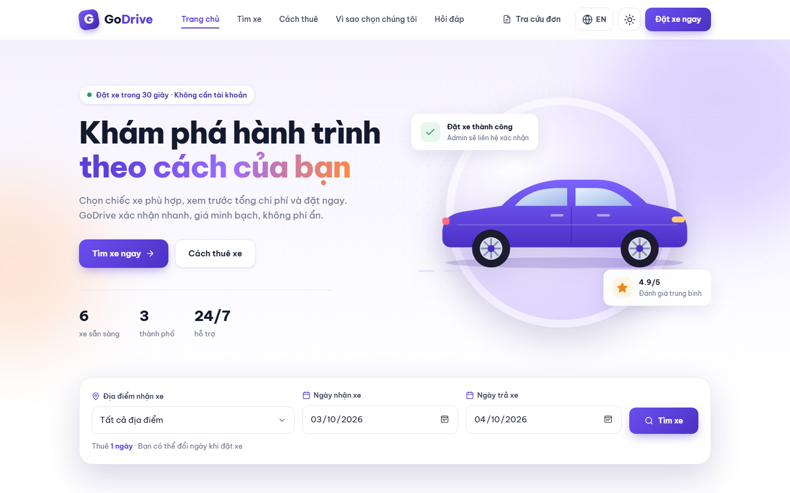
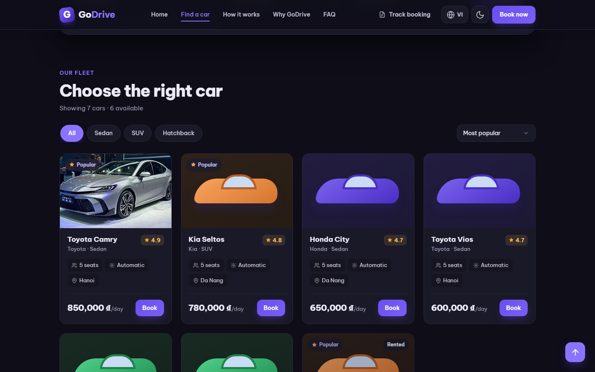
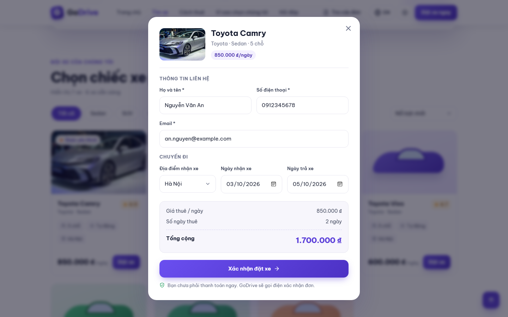
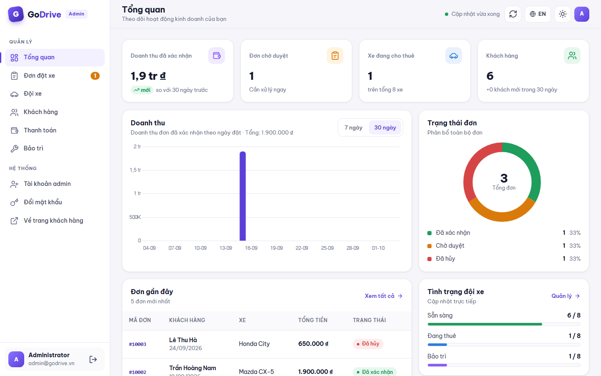
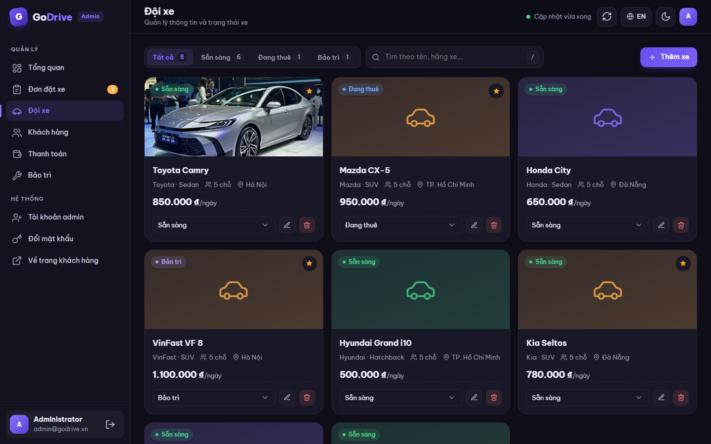
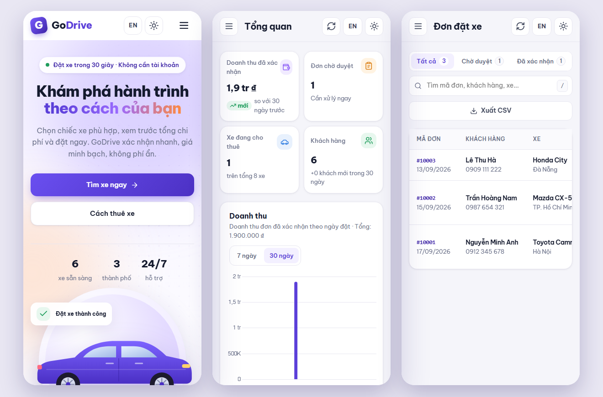

<div align="center">

# 🚗 GoDrive — Self-Drive Car Rental App

**Book in 30 seconds · No account needed · Transparent pricing**

A car rental website with a **customer site** and an **admin dashboard**, built with plain HTML, CSS, JavaScript and PHP.
Data is stored in JSON files, so no database is required. Runs on free PHP hosting such as InfinityFree.


**English** · [Tiếng Việt](README.vi.md)

</div>

---

## 📸 Screenshots

<table>
  <tr>
    <td width="62%"></td>
    <td width="38%">
      <h3>🏠 Home page</h3>
      <p>Service overview, the number of cars available right now, and a search box for pick-up location and rental dates.</p>
    </td>
  </tr>
  <tr>
    <td width="38%">
      <h3>🌙 Dark mode & English</h3>
      <p>Filter cars by type and sort by price or popularity. Switch Vietnamese ↔ English and light ↔ dark straight from the navigation bar.</p>
    </td>
    <td width="62%"></td>
  </tr>
  <tr>
    <td width="62%"></td>
    <td width="38%">
      <h3>📝 Booking</h3>
      <p>Only a name, phone number and email are needed. The total is calculated from the number of rental days, and mistakes are flagged right under each field.</p>
    </td>
  </tr>
  <tr>
    <td width="38%">
      <h3>📊 Admin dashboard</h3>
      <p>Real revenue for the last 7 or 30 days compared with the previous period, booking status, fleet status and a to-do list.</p>
    </td>
    <td width="62%"></td>
  </tr>
  <tr>
    <td width="62%"></td>
    <td width="38%">
      <h3>🚙 Fleet management</h3>
      <p>Add, edit and delete cars, change a car's status right on its card, mark cars as featured and add photos by URL.</p>
    </td>
  </tr>
  <tr>
    <td width="38%">
      <h3>📱 Mobile friendly</h3>
      <p>Both the customer site and the admin dashboard work well on small screens, with a collapsible menu and bottom-sheet dialogs.</p>
    </td>
    <td width="62%"></td>
  </tr>
</table>

---

## ✨ Features

### For customers

- Browse cars, filter by type (Sedan / SUV / Hatchback) and location, sort by price or popularity
- Book **without creating an account**; the total is calculated automatically from the rental days
- **Double bookings are blocked** for the same car
- Track a booking with the **email and phone number** used when booking
- Contact details are remembered for the next booking
- **Vietnamese & English** and **light/dark mode** (follows the device setting on first visit)

### For administrators (`/admin`)

- Dashboard with real revenue, trends versus the previous period and a to-do list
- Booking management: approve, hand over the car, cancel, view details, call or email the customer
- Manage the fleet, customers, payments and maintenance schedules
- Export bookings, customers and payments to CSV
- Create/delete admin accounts, change password
- Data auto-refreshes every minute; press `/` to jump to the search box
- Same bilingual interface and light/dark mode as the customer site

---

## 🚀 Installation & running locally

### 1. Install PHP 8 or later

- **Windows:** open PowerShell and run
  ```powershell
  winget install PHP.PHP.8.4
  ```
  When it finishes, **reopen your terminal** so the `php` command is available.
- **macOS:** `brew install php`
- **Ubuntu/Debian:** `sudo apt install php-cli`

Check with `php -v`.

### 2. Get the source code

```bash
git clone https://github.com/s1gnuh/Car-Rental-App-GoDrive.git
cd Car-Rental-App-GoDrive
```

### 3. Run the app

```bash
php -S localhost:8080 router.php
```

Open your browser:

| Page | URL |
|---|---|
| Customer site | http://localhost:8080/ |
| Admin dashboard | http://localhost:8080/admin |

**Default admin account:** `admin` / `admin123`. **Change the password** right after your first sign-in.

> ⚠️ Don't open `index.html` directly (double-click or Live Server). The PHP API won't run that way and the car list won't load.

---

## 📖 Customer guide

### Finding a car

1. In the search box on the home page, choose the **Pick-up location**, **Pick-up date** and **Return date**, then click **Search**.
2. In **Choose the right car**, click **Sedan**, **SUV** or **Hatchback** to filter by type.
3. Use the sort menu on the right to order by **Most popular**, **Price: low to high** or **Price: high to low**.
4. Cars labelled **Rented** or showing an **Unavailable** button can't be booked at the moment.

### Booking a car

1. Click **Book** on the car you want.
2. Fill in your contact details:
   - **Full name:** letters only (Vietnamese accents allowed) and spaces.
   - **Phone number:** digits only, 9 to 10 digits.
   - **Email:** used for updates and to look up your booking.
3. Choose the pick-up location, pick-up date and return date. The maximum rental period is 90 days.
4. Check the **Total** (daily rate × number of days) and click **Confirm booking**.
5. The success screen shows your **booking code**. The booking stays **Pending** until GoDrive calls you to confirm.

> No payment is taken when you book. If the car is already booked for the dates you picked, the system tells you and won't allow a double booking.

### Tracking a booking

1. Click **Track booking** in the navigation bar or the footer.
2. Enter **both the email and the phone number** you used when booking. Both are required to protect your booking.
3. Click **View my bookings** to see your bookings, rental dates, totals and status: *Pending*, *Confirmed* or *Cancelled*.

### Changing language and theme

- Click **🌐 EN / VI** to switch between Vietnamese and English.
- Click **☀ / 🌙** to switch between light and dark mode.
- Your choice is remembered for future visits and shared with the admin dashboard.

---

## 🛠️ Admin guide

### Signing in

Go to `/admin` and enter your username (or email) and password. Click the 👁 icon to show or hide the password. A session lasts 7 days.

### Dashboard

- **4 stat cards:** confirmed revenue, pending bookings (click to open the pending list), cars on rent, and customers.
- **Revenue chart:** choose **7 days** or **30 days**. Revenue is grouped by the booking date of confirmed bookings.
- **Booking status**, **fleet status** and a **to-do list**. You can approve bookings directly from the to-do list.

### Bookings

How a booking moves through the system:

```
Pending ──[Approve]──▶ Confirmed ──[Hand over]──▶ Car becomes "On rent"
   │                       │
   └───────[Cancel]────────┴──▶ Cancelled (a car on rent goes back to "Available")
```

- Use the **All / Pending / Confirmed / Cancelled** tabs and the search box (booking code, customer name, phone, email or car).
- Click a row to open the **booking details**, including a button to call the customer.
- Cancelling always asks for confirmation to prevent accidental clicks.
- Click **Export CSV** to download the booking list for Excel.

### Fleet

- **Add a car:** click **+ Add car** and enter the name, brand, type, seats, daily rate and location. The photo is a URL starting with `https://`.
- Tick **Mark as featured on the customer site** to give the car a "Popular" badge and show it first on the customer site.
- **Change status:** pick *Available / On rent / Maintenance* right on the car card. When a customer returns a car, set it back to **Available**.
- Cars in **Maintenance** are hidden from the customer site.

### Customers

Customers are added automatically on their first booking. Each new booking adds to their booking count and total spent. The list is sorted by spending and can be exported to CSV.

### Payments

Shows the amount collected, pending and refunded, plus the transaction history, with status filters and CSV export. Data is read from `data/payments.json`. Online payment gateways are not integrated yet.

### Maintenance

1. Click **+ Schedule maintenance**, choose the car, service, start and end dates, cost and notes.
2. Click **Start**: the car switches to **Maintenance** automatically.
3. Click **Complete**: the car goes back to **Available** automatically.

### Accounts & security

- **Admin accounts** (left sidebar): view the list, create new accounts and delete other accounts. You can't delete yourself, and at least one admin must remain.
- **Change password:** enter your current password and a new one (at least 6 characters). The colour bar shows password strength.

### Tips

- Press `/` to jump to the search box on the current page.
- Press `Esc` to close dialogs.
- Data refreshes every minute; click ↻ to refresh immediately.

---

## ☁️ Deploying (InfinityFree or any PHP host)

1. Upload all the source files to your site's root folder (`htdocs` on InfinityFree).
2. Make sure the `data/` folder is **writable** so bookings and the secret file can be saved.
3. Visit `https://your-domain/data/admins.json`: it **must return 403 (Forbidden)**. If you can see the file contents, `.htaccess` isn't working.
4. Sign in at `/admin` and **change the default password immediately**.

> `router.php` is only used when running locally. On Apache hosting, the `.htaccess` files handle routing and block access to `data/`.

### Updating the live site

1. Build the deploy package (Windows PowerShell, in the project folder):
   ```powershell
   powershell -ExecutionPolicy Bypass -File .\build-deploy.ps1
   ```
   This stamps a new version into `version.json` and the `?v=` links in the HTML, then creates `..\godrive-deploy.zip` **without the `data/` folder**.
2. In the File Manager, upload the zip into `htdocs`, **Extract** it with **Overwrite**, then delete the zip.
3. Open the admin dashboard → **Load latest version** (left sidebar). The **User guide → Updating the website** tab shows the version you are using and the version on the server.

> Never upload the `data/` folder over the live site: it would erase real bookings. Browsers also pick up the new version automatically on their next visit thanks to the version check and the no-cache headers in `.htaccess`.

---

## 🗂️ Project structure

```
├── index.html            # Customer site
├── admin.html            # Admin dashboard
├── css/
│   ├── style.css         # Customer site styles (light/dark)
│   └── admin.css         # Admin styles (light/dark)
├── js/
│   ├── app.js            # Customer site logic + VI/EN translations
│   └── admin.js          # Admin logic + VI/EN translations
├── api/                  # PHP API
│   ├── _helpers.php      # Shared helpers: JSON read/write, tokens, validation
│   ├── login.php         # Sign-in, change password, admin accounts
│   ├── products.php      # Car list and fleet management
│   ├── orders.php        # Bookings, lookup, approve/cancel
│   └── users.php         # Customers, payments, maintenance
├── data/                 # JSON data (blocked from web access)
├── docs/screenshots/     # Screenshots used in the README
├── .htaccess             # Apache config: /admin route, block hidden files
└── router.php            # Router for local runs with php -S
```

### Data files

| File | Contents |
|---|---|
| `data/cars.json` | Cars |
| `data/bookings.json` | Bookings |
| `data/customers.json` | Customers (created automatically on booking) |
| `data/payments.json` | Payment history |
| `data/maintenance.json` | Maintenance schedule |
| `data/admins.json` | Admin accounts (passwords hashed with bcrypt) |
| `data/.jwt_secret` | Session signing key, **generated automatically** on first run, never committed |

---

## 🔌 API

| Endpoint | Method | Purpose | Auth required |
|---|---|---|---|
| `api/products.php` | GET | List cars | No |
| `api/products.php` | POST / PUT / PATCH / DELETE | Add, edit, change status, delete cars | Yes |
| `api/orders.php` | POST | Customer booking | No |
| `api/orders.php?action=lookup` | GET | Look up bookings (email and phone required) | No |
| `api/orders.php` | GET / PATCH | List all bookings, approve/cancel/hand over | Yes |
| `api/login.php` | POST | Sign in, get a token | No |
| `api/login.php?action=...` | GET / POST / DELETE | Admin profile, change password, manage admins | Yes |
| `api/users.php?action=...` | GET / POST / PATCH / DELETE | Customers, payments, maintenance | Yes |

The API reads the token from the `Authorization: Bearer <token>` header.

---

## 🔐 Security

- The token signing key is **randomly generated** and stored in `data/.jwt_secret` (already in `.gitignore`). You can pin it with the `GODRIVE_JWT_SECRET` environment variable (at least 16 characters). Deleting the file signs out every admin.
- Admin passwords are hashed with **bcrypt**.
- All customer input is **escaped when displayed** to prevent XSS. Photo links must be `http(s)`, and Excel formulas are neutralised in CSV exports.
- Every write API **validates its input** and runs one at a time behind a file lock (`data/.write.lock`), so no data is lost when several people book at once.
- The `data/` folder and hidden files are blocked from direct access, both on hosting (`.htaccess`) and locally (`router.php`).

---

## ❓ Troubleshooting

<details>
<summary><b>The car list doesn't load / "Couldn't reach the server"</b></summary>

You're opening the HTML file directly or PHP isn't running. Run `php -S localhost:8080 router.php` in the project folder and open http://localhost:8080.
</details>

<details>
<summary><b>The <code>php</code> command is not found</b></summary>

PHP isn't installed, or the terminal hasn't picked up the new path yet. Close the terminal, open it again and run `php -v`.
</details>

<details>
<summary><b>Forgot the admin password</b></summary>

Generate a new password hash:

```bash
php -r "echo password_hash('newpassword', PASSWORD_BCRYPT);"
```

Open `data/admins.json` and replace the account's `passwordHash` value with the generated string.
</details>

<details>
<summary><b>On hosting, sign-in works but every action says "Not signed in"</b></summary>

Some hosts strip the `Authorization` header. The included `.htaccess` already forwards it, so make sure the `.htaccess` file (a hidden file) was uploaded too.
</details>

<details>
<summary><b>The UI doesn't update after changing the code</b></summary>

Press **Ctrl + F5** (macOS: **Cmd + Shift + R**) to make the browser reload the new CSS and JS.
</details>

---

## 🗺️ Roadmap

- [ ] Online payments (VNPay / MoMo) and deposits
- [ ] Email/SMS confirmation when booking and when a booking is approved
- [ ] Let customers cancel their own pending bookings
- [ ] Calendar showing the dates a car is already booked
- [ ] Car detail page with multiple photos and reviews from past renters
- [ ] Hand-over/return records: mileage, fuel level, condition photos
- [ ] PDF invoices, admin roles, activity log
- [ ] Move data from JSON to MySQL as bookings grow

---

## 📞 Contact

- Hotline: **0365 551 920**
- Email: support@godrive.vn

<div align="center"><sub>© 2026 GoDrive. All rights reserved.</sub></div>
